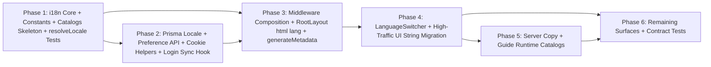

# System Decomposition — i18n-multilingual-vi-en-ja

## 1. Dependency Graph

## 2. Implementation Phases

### Phase 1: i18n Core + Constants + Catalogs Skeleton + resolveLocale Tests

- **Objective**: Establish the thin custom i18n foundation in `src/lib/i18n` and the `messages/{vi,en,ja}/` catalog layout. Deliver pure locale resolution and catalog loading utilities with full unit-test coverage, with no dependency on middleware, Prisma, or UI components yet.
- **Boundaries**:
  - `src/lib/i18n/constants.ts` — `Locale` type, `SUPPORTED_LOCALES`, default `DEFAULT_LOCALE = 'vi'`, cookie name `APP_LOCALE_COOKIE`, `ACCEPT_LANGUAGE_MAP`, ISO→Open Graph locale map.
  - `src/lib/i18n/resolveLocale.ts` — pure `resolveLocale({ dbLocale?: Locale | null, cookieLocale?: string, acceptLanguage?: string })` implementing order: DB non-null → valid cookie → Accept-Language map → `vi`.
  - `src/lib/i18n/catalog.ts` — `loadCatalog(locale)` that loads **only** the active locale JSON files from `messages/{locale}/` (e.g. `common.json`, `auth.json`, `guide.json`) and merges/returns a flat or nested dictionary.
  - `src/lib/i18n/t.ts` — server-safe `t(catalog, key, interpolations?)` helper.
  - `messages/{vi,en,ja}/common.json` — minimal skeleton (a handful of verified keys) to validate loading and interpolation.
  - `src/lib/i18n/__tests__/resolveLocale.test.ts`, `catalog.test.ts`, `t.test.ts`.
- **Dependencies**: None

### Phase 2: Prisma Locale + Preference API + Cookie Helpers + Login Sync Hook

- **Objective**: Add persistence. Introduce the `Locale` enum and nullable `User.preferredLocale` in Prisma, expose `GET`/`PATCH /api/user/preferences`, create server cookie helpers, and implement the login-time preference sync hook (DB ↔ cookie) so guest choices survive authentication.
- **Boundaries**:
  - `prisma/schema.prisma` — add `enum Locale { vi en ja }` and `User.preferredLocale Locale?`.
  - `prisma/migrations/<timestamp>_add_user_locale/` — additive nullable migration; no backfill.
  - `src/lib/i18n/cookies.ts` — `getLocaleCookie(req)`, `setLocaleCookie(res, locale, opts)` enforcing `SameSite=Lax`, `Path=/`, non-HttpOnly, `Secure` in prod, ~1 year `Max-Age`.
  - `src/app/api/user/preferences/route.ts` — `GET` returns `{ preferredLocale: Locale | null }`; `PATCH` validates body, authorizes via session `user.id`, writes DB, sets cookie, rejects mismatched `Origin`.
  - `src/lib/auth/login-sync.ts` (or integration with `auth.config` `events.signIn` / post-login flow) — implements authoritative sync rules:
    1. DB non-null → set cookie.
    2. DB null + valid cookie → persist cookie to DB.
    3. both missing → Accept-Language → `vi`; set cookie; optionally persist on first login.
  - `src/app/api/user/preferences/__tests__/route.test.ts`, `src/lib/auth/__tests__/login-sync.test.ts`.
- **Dependencies**: Phase 1

### Phase 3: Middleware Composition + RootLayout html lang + generateMetadata

- **Objective**: Wire locale resolution into request flow. Extend the existing next-auth middleware to resolve and refresh the locale, set `x-app-locale`, and drive `<html lang>` and dynamic `generateMetadata()` from the active request catalog.
- **Boundaries**:
  - `src/middleware.ts` (existing next-auth `auth((req) => …)`) — insert locale resolution **inside** the auth handler after redirect checks. For each request: resolve locale (session + DB nullability checked only when session present; otherwise cookie/Accept-Language), ensure `app-locale` cookie is valid/ refreshed, set `req.headers.set('x-app-locale', locale)`. No URL rewriting, no separate middleware file.
  - `src/lib/i18n/getRequestLocale.ts` — read `x-app-locale` then cookie fallback for RSC and Route Handlers.
  - `src/app/layout.tsx` (`RootLayout`) — read server locale, set `<html lang={locale}>`, pass locale/catalog to `LocaleProvider`.
  - `src/lib/i18n/LocaleProvider.tsx` + `useTranslations()` — client context and hook for nested components.
  - `src/app/layout.tsx` / page-specific `generateMetadata()` — replace static metadata exports with dynamic, locale-aware metadata that loads active catalog only.
  - `src/lib/seo/createRootMetadata.ts` (or equivalent) — make locale-aware using OG locale map.
  - Tests: middleware locale header/cookie tests; `generateMetadata` snapshot tests for each locale.
- **Dependencies**: Phase 1, Phase 2

### Phase 4: LanguageSwitcher + High-Traffic UI String Migration

- **Objective**: Deliver the user-facing switcher and migrate the most visible hardcoded strings to catalogs so core navigation and chrome are localized.
- **Boundaries**:
  - `src/components/i18n/LanguageSwitcher.tsx` — accessible (keyboard focus, aria-pressed/selected), options `vi | en | ja`; on change writes cookie immediately and, if session exists, calls `PATCH /api/user/preferences`; then `router.refresh()` (soft refresh).
  - `src/components/layout/Header.tsx`, `NavChrome`, `Footer` — migrate labels, aria-labels, buttons to `t('common.*')`.
  - `src/app/page.tsx` and top-level pages (`/login`, `/register`, `/dashboard`) — migrate visible UI strings.
  - `messages/{vi,en,ja}/common.json` — expand to cover all migrated keys.
  - Tests: component tests for `LanguageSwitcher`; visual regression not required, but keyboard interaction tests are.
- **Dependencies**: Phase 3

### Phase 5: Server Copy + Guide Runtime Catalogs

- **Objective**: Localize server-only surfaces that touch users directly: API error messages, auth/system emails, and guide/assistant prompts. Ensure guide content is loaded from runtime catalogs rather than build-time hardcoded `locale: 'vi'`.
- **Boundaries**:
  - Route Handlers (`src/app/api/**`) — import `getRequestLocale()` + `loadCatalog(locale)` for user-facing error messages; never use static Vietnamese strings for validation/API errors.
  - `src/lib/auth/email.ts` (or auth email templates) — localized email subject/body via `messages/{locale}/auth.json` or `emails.json`.
  - `src/lib/guide/prompts.ts` (or assistant callers) — replace hardcoded `locale: 'vi'` with runtime catalog from `messages/{locale}/guide.json`.
  - `scripts/generate-guide-config.mjs` — remove frozen `locale: 'vi'` user-facing copy; if still emitting structure, ensure prompt text keys reference `messages/{locale}/guide.json`.
  - `messages/{vi,en,ja}/auth.json`, `emails.json`, `guide.json` — create and fill.
  - Tests: snapshot tests for localized emails; guide prompt tests asserting active locale; API error message tests.
- **Dependencies**: Phase 3, Phase 4 (for shared `common.json` patterns if reused)

### Phase 6: Remaining Surfaces + Contract Tests

- **Objective**: Finish migrating any leftover UI surfaces and add contract tests that enforce the system-brief invariants: study content is never translated, guest EN/JA survives login, and authz boundaries hold.
- **Boundaries**:
  - Remaining components/pages not touched in Phase 4 — migrate hardcoded strings to catalogs.
  - `messages/{vi,en,ja}/` completeness audit — ensure every catalog key exists in all three locales.
  - `src/lib/i18n/__tests__/contracts.test.ts`:
    - `study content never passed through t()` — grep/static analysis check that flashcard, set, term, definition strings do not call `t()`.
    - Guest EN/JA survives login — simulate no DB preference + `app-locale=en` cookie → login sync persists `preferredLocale = en`.
    - Guest VI fallback on first visit — no cookie + `Accept-Language: es` → resolves `vi`.
    - Origin reject on PATCH — cross-origin `PATCH /api/user/preferences` returns 403.
    - DB preference wins over cookie — `preferredLocale=ja` + `app-locale=en` → resolves `ja`.
  - `src/middleware.ts` integration smoke tests for locale header/cookie refresh.
  - Final verification: no hardcoded UI strings remain in migrated components; all system copy in catalogs.
- **Dependencies**: Phase 4, Phase 5

## 3. Completeness Check

| system-brief Requirement                                                     | Covered By                                                                                             |
| ---------------------------------------------------------------------------- | ------------------------------------------------------------------------------------------------------ |
| `vi/en/ja` UI/system copy with `vi` default/fallback                         | Phase 1 (constants, resolver), Phase 5/6 (catalogs)                                                    |
| Deterministic locale resolution: DB → cookie → Accept-Language → `vi`        | Phase 1 (resolver), Phase 2 (cookie helpers, DB field), Phase 3 (middleware), Phase 6 (contract tests) |
| Reusable message catalogs                                                    | Phase 1 (skeleton), Phase 4/5/6 (filling)                                                              |
| Language switcher, immediate apply (soft refresh)                            | Phase 4                                                                                                |
| Cookie + DB persistence; guests use cookie, logged-in sync                   | Phase 2 (API, login sync), Phase 4 (switcher), Phase 6 (contract tests)                                |
| No URL prefix; compose with next-auth middleware                             | Phase 3 (middleware only)                                                                              |
| Study content raw / not translated                                           | Phase 6 (contract test + audit)                                                                        |
| SEO `html lang` + `generateMetadata`                                         | Phase 3                                                                                                |
| Guide/assistant prompt locale wiring                                         | Phase 5                                                                                                |
| Auth and email localization                                                  | Phase 5                                                                                                |
| Cookie security attributes (`SameSite=Lax`, `Secure`, non-HttpOnly, Max-Age) | Phase 2                                                                                                |
| `User.preferredLocale` nullable                                              | Phase 2                                                                                                |
| Accept-Language map                                                          | Phase 1 (constants), Phase 3/6                                                                         |
| Performance: load active locale only                                         | Phase 1 (catalog loader), Phase 3                                                                      |
| Accessibility: document `lang`, keyboard switcher                            | Phase 3, Phase 4                                                                                       |

**Union of boundaries** covers all in-scope surfaces of `system-brief.md` and respects the locked architecture decisions from `architecture/overview.md`, `frontend.md`, `backend.md`, `adr-001-i18n-library.md`, and `adr-002-locale-persistence.md`.

## 4. Phase Dependency Validation

The dependency graph is acyclic. Each phase only references earlier phases:

| Phase   | Dependencies     | All Earlier? |
| ------- | ---------------- | ------------ |
| Phase 1 | None             | Yes          |
| Phase 2 | Phase 1          | Yes          |
| Phase 3 | Phase 1, Phase 2 | Yes          |
| Phase 4 | Phase 3          | Yes          |
| Phase 5 | Phase 3, Phase 4 | Yes          |
| Phase 6 | Phase 4, Phase 5 | Yes          |

No backward references, no cycles.

## 5. Residual Review Items (Verification Notes)

Captured from `.opsx/reviews/review-summary.md` for final-phase verification rather than re-architecture:

1. **Pin exact login-sync hook** — decide between `auth.config` `events.signIn` and an explicit post-login route/handler; document the chosen integration point in `src/lib/auth/login-sync.ts` comments and ensure it runs once per login.
2. **Contract tests**:
   - Study-generated strings never pass through `t()`.
   - Guest `en`/`ja` choice persists into `User.preferredLocale` on first login.
   - `PATCH /api/user/preferences` rejects mismatched `Origin`.
3. **Single-source guide catalogs** — force all guide/assistant prompt copy to live in `messages/{locale}/guide.json`; do not allow prompt builders to embed locale-specific text elsewhere.
4. **Optional polish** — evaluate `Vary: Cookie` / rate-limit on `PATCH` preference as implementation-phase enhancements, not architecture changes.
